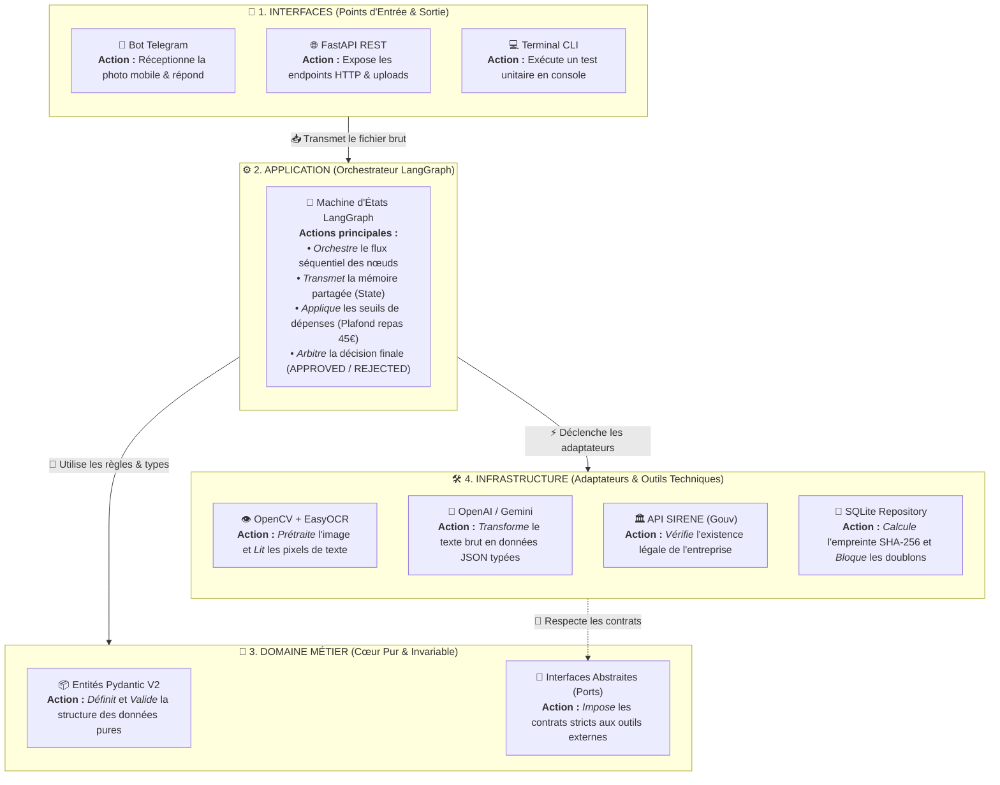
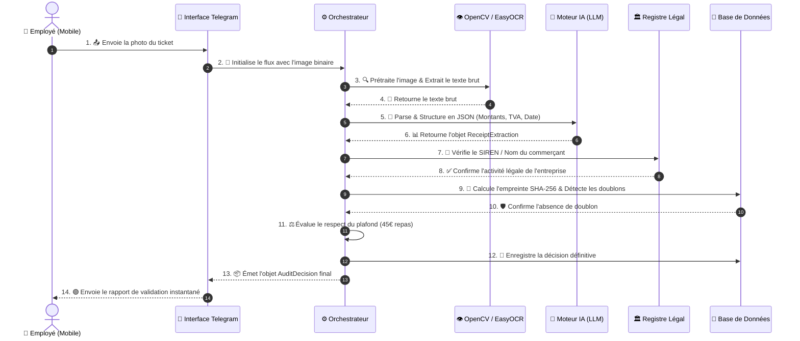

# 🛡️ ExpensyGuard - Audit Automatisé de Reçus Fiscaux

[](https://www.python.org/)
[](https://martinfowler.com/bliki/HexagonalArchitecture.html)
[](https://github.com/langchain-ai/langgraph)
[](https://docs.pytest.org/)

**ExpensyGuard** est un système d'audit automatique et intelligent de notes de frais et de reçus de caisse. Il permet aux collaborateurs d'envoyer des photos de tickets (via smartphone/Telegram), applique un prétraitement optique (OCR), extrait les données financières par IA, valide la légalité du commerçant (API SIRENE), et bloque les doublons en base SQL.

---

## 🏛️ Architecture Hexagonale avec Rôles & Actions Verbeuses

Chaque couche a une responsabilité unique et précise, exprimée par des verbes d'action :



---

## 🔄 Flux Séquentiel d'un Reçu (Workflow d'Audit)

Le parcours étape par étape avec les actions effectuées à chaque maillon de la chaîne :



---

## 📁 Arborescence du Projet

```text
expensyguard/
├── .env.example              # Gabarit des variables de configuration
├── README.md                 # Présentation & documentation du projet
├── connexion_to_bot.md       # Guide détaillé de l'intégration Telegram
├── plan_projet.md            # Spécifications et blueprint technique
├── pyproject.toml            # Dépendances du projet (uv)
├── src/
│   ├── __init__.py
│   ├── domain/               # 💎 Cœur Métier Pur (Sans I/O)
│   │   ├── __init__.py
│   │   ├── models.py         # Entités Pydantic V2 & Decimal (Receipt, Tax, Status)
│   │   └── ports.py          # Interfaces abstraites (Contrats hexagonaux)
│   ├── infrastructure/       # 🛠️ Adaptateurs Techniques (I/O, APIs, BDD)
│   │   ├── __init__.py
│   │   ├── ocr_adapter.py    # Prétraitement OpenCV + Reconnaissance EasyOCR
│   │   ├── llm_adapter.py    # Client OpenAI / Google Gemini
│   │   ├── registry_api.py   # Client HTTP asynchrone (API Entreprises SIRENE)
│   │   └── db_repository.py  # SQLite & détection de doublons (SHA-256)
│   ├── application/          # ⚙️ Orchestration des Cas d'Usage
│   │   ├── __init__.py
│   │   ├── state.py          # État partagé du graphe (AuditFlowState)
│   │   ├── nodes.py          # Nœuds atomiques de décision et d'audit
│   │   └── graph.py          # Assemblage StateGraph & compilation LangGraph
│   └── interfaces/           # 🚪 Points d'Entrée Utilisateurs
│       ├── __init__.py
│       ├── telegram_bot.py   # Bot Telegram (Réception photo mobile & réponse direct)
│       ├── cli.py            # Commande CLI locale
│       └── api/              # API REST FastAPI
│           ├── __init__.py
│           └── main.py
└── tests/
    ├── __init__.py
    ├── unit/                 # Tests unitaires des modèles et de la validation
    │   ├── __init__.py
    │   └── test_domain_models.py
    └── integration/          # Tests d'intégration du graphe LangGraph complet
        ├── __init__.py
        └── test_full_pipeline.py
```

---

## 🚀 Guide de Démarrage Rapide

### 1. Installation des dépendances
```bash
uv sync
```

### 2. Configuration (`.env`)
Copiez le fichier exemple et renseignez vos clés :
```bash
cp .env.example .env
```

### 3. Exécution des Tests Automatisés
```bash
uv run pytest -v
```

### 4. Lancer le Bot Telegram
```bash
uv run python -m src.interfaces.telegram_bot
```

### 5. Lancer l'API REST FastAPI
```bash
uv run uvicorn src.interfaces.api.main:app --reload --port 8000
```
> *Documentation Swagger disponible sur : `http://localhost:8000/docs`*
