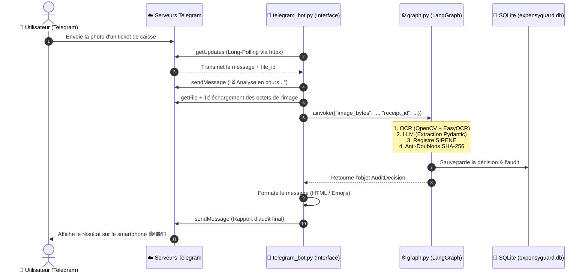

# Guide Technique & Architecture : Intégration du Bot Telegram

Ce document détaille le fonctionnement complet de l'intégration entre **Telegram** et **ExpensyGuard**, le rôle de chaque bloc de code dans [src/interfaces/telegram_bot.py](file:///c:/Tahiri/QRA/expensyguard/src/interfaces/telegram_bot.py), et les raisons architecturales de cette conception.

---

## 🏛️ 1. Pourquoi cette Architecture ?

Dans une **Clean Architecture (Architecture Hexagonale)**, le Bot Telegram est placé dans le dossier **`src/interfaces/`** :

```text
expensyguard/
├── src/
│   ├── domain/           # 1. Règles comptables & Modèles de données purs
│   ├── infrastructure/   # 2. Outils techniques (OpenCV, SQLite, OpenAI, SIRENE)
│   ├── application/      # 3. Graphe d'états LangGraph (Le Chef d'Orchestre)
│   └── interfaces/       # 4. Points d'Entrée & Sortie (CLI, API FastAPI, Bot Telegram)
│       └── telegram_bot.py
```

### Les 4 Bénéfices de ce choix :

1. **Indépendance Totale (Découplage) :** 
   Le moteur d'audit (OCR, LLM, base de données) ne sait même pas que Telegram existe. Pour lui, Telegram est juste un "fournisseur d'octets d'images", exactement comme le CLI ou FastAPI.
2. **Interchangeabilité :** 
   Si demain vous souhaitez remplacer Telegram par **WhatsApp**, **Slack** ou une application mobile iOS/Android, vous n'avez pas besoin de toucher à une seule ligne de `domain/`, `application/` ou `infrastructure/`. Vous créez simplement `whatsapp_bot.py` dans `interfaces/`.
3. **Zéro Dépendance Lourde Supplémentaire :** 
   Au lieu d'installer des bibliothèques externes lourdes (`python-telegram-bot`, `aiogram`), nous utilisons directement le client HTTP asynchrone **`httpx`** (déjà présent dans le projet). Le code reste léger, rapide et totalement maîtrisé.
4. **Mode Long-Polling Asynchrone :** 
   Permet à votre bot de fonctionner immédiatement en local sur votre PC **sans avoir à ouvrir de ports sur votre box internet ni configurer de tunnel ngrok**.

---

## 🔄 2. Schéma du Flux de Données



---

## 🔍 3. Explication Détaillée du Code (`telegram_bot.py`)

Voici l'analyse des composants clés du fichier :

---

### A. Le Chargement Automatique de l'Environnement (`load_dotenv_custom`)
```python
def load_dotenv_custom(env_path: Optional[str] = None) -> None:
```
* **Rôle :** Par défaut, Python ne lit pas automatiquement les fichiers `.env`. 
* **Fonctionnement :** Cette fonction ouvre le fichier `.env` à la racine, lit les clés (`TELEGRAM_BOT_TOKEN`, `LLM_API_KEY`, etc.) et les injecte dans la mémoire système (`os.environ`).

---

### B. L'Initialisation du Bot (`__init__`)
```python
class TelegramReceiptBot:
    def __init__(self, token: Optional[str] = None):
        load_dotenv_custom()
        self.token = token or os.getenv("TELEGRAM_BOT_TOKEN", "")
        self.api_url = f"https://api.telegram.org/bot{self.token}"
        self.offset = 0
```
* **`self.api_url` :** L'adresse officielle de l'API Telegram sécurisée par votre jeton unique.
* **`self.offset` :** Un compteur qui permet d'indiquer à Telegram *"J'ai déjà traité ce message, ne me le renvoie pas"*.
* **Instanciation des composants :** Le bot prépare les adaptateurs réels (OCR, LLM, BDD) et compile le graphe LangGraph une seule fois au démarrage pour des performances maximales.

---

### C. La Boucle d'Écoute Long-Polling (`run_polling`)
```python
async def run_polling(self) -> None:
    async with httpx.AsyncClient(timeout=30.0) as client:
        while True:
            poll_url = f"{self.api_url}/getUpdates"
            params = {"offset": self.offset, "timeout": 20}
            response = await client.get(poll_url, params=params)
            ...
```
* **Principe du Long-Polling :** Votre serveur ouvre une connexion HTTP vers Telegram et attend jusqu'à 20 secondes (`timeout=20`). 
* Dès qu'un message arrive, Telegram répond instantanément. Si aucun message n'arrive au bout de 20 secondes, la requête se termine proprement et une nouvelle est relancée.
* **Non-bloquant :** Grâce à `asyncio` et `httpx`, cette boucle ne consomme quasiment aucun processeur tant qu'aucun message n'arrive.

---

### D. La Réception et Téléchargement de la Photo (`download_photo`)
```python
async def download_photo(self, client: httpx.AsyncClient, file_id: str) -> bytes:
    # 1. On demande à Telegram où se trouve physiquement le fichier
    get_file_url = f"{self.api_url}/getFile"
    response = await client.get(get_file_url, params={"file_id": file_id})
    file_path = response.json()["result"]["file_path"]
    
    # 2. On télécharge directement le flux d'octets binaires
    download_url = f"https://api.telegram.org/file/bot{self.token}/{file_path}"
    img_response = await client.get(download_url)
    return img_response.content
```
* Telegram ne vous envoie pas l'image directement dans le message, mais un identifiant temporaire (`file_id`).
* Le bot demande l'URL de téléchargement via `getFile`, puis télécharge directement l'image sous forme de tableau d'octets (`bytes`) en mémoire RAM. Aucun fichier temporaire inutile n'est écrit sur le disque.

---

### E. L'Exécution de l'Audit & Formatage du Rapport (`process_update` & `format_audit_message`)
```python
# 1. On injecte les octets dans le graphe LangGraph
state = {
    "receipt_id": receipt_id,
    "image_bytes": image_bytes,
    "file_name": f"{receipt_id}.jpg",
    "anomalies": [],
}
result = await self.audit_graph.ainvoke(state)
decision = result.get("decision")
```
* Le bot transmet l'image au graphe qui exécute la chaîne d'analyse (OCR -> LLM -> SIRENE -> SQLite).
* `format_audit_message()` transforme l'objet typé `AuditDecision` en un message élégant en HTML avec émojis :
  * 🟢 **REÇU CONFORME ET VALIDÉ**
  * 🟠 **REÇU EN ATTENTE DE VÉRIFICATION**
  * 🔴 **REÇU NON CONFORME / REJETÉ**

---

## 🎯 4. En Résumé

| Caractéristique | Implémentation dans ExpensyGuard |
| :--- | :--- |
| **Couche Architecturale** | `src/interfaces/` (Adaptateur d'entrée/sortie) |
| **Protocole de communication** | Telegram Bot API HTTPS via `httpx.AsyncClient` |
| **Mode de fonctionnement** | Long-Polling asynchrone (aucune configuration réseau requise) |
| **Gestion mémoire** | Streaming en mémoire RAM sans stockage de fichiers temporaires |
| **Découplage** | Intégration 100% isolée du moteur métier LangGraph |
